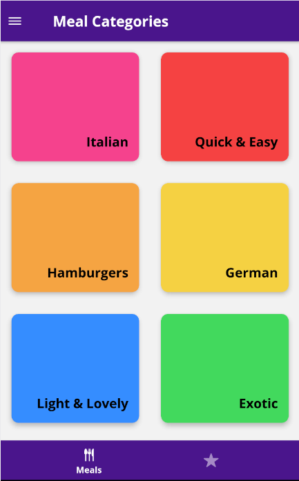
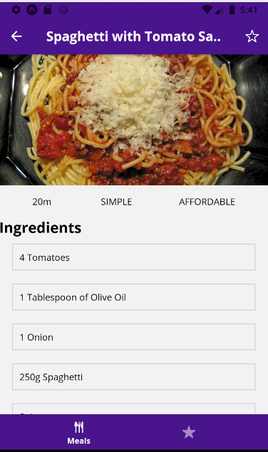
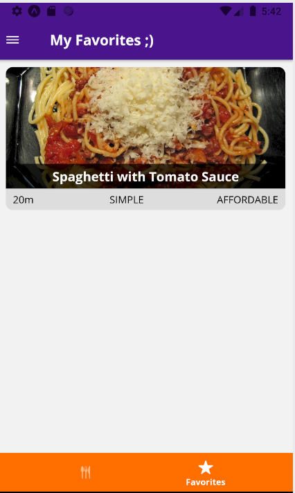
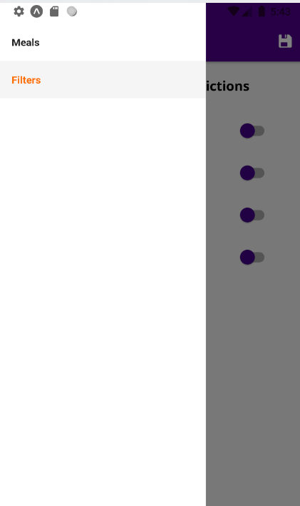
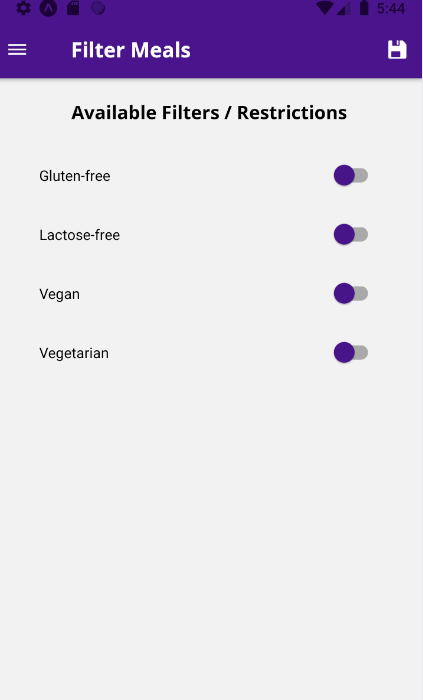

# my-meals-app
This project was developed in the course React Native - The Practical Guide 2020. In this section, we are building an app that shows a set of recipes grouped by categories, the user can choose a category and see the related dishes and each recipe and give astar to save it in favorites,also the user can filter all the meals depending on the preferences . In this part of the course we are focused on learning all about navigation, by using the Navigation APIs v4 and v5.

# Technologies
- React Native
- Expo
- React Native Navigation (Stack, Drawer, Bottom Tab)
- Redux

#  Preview

